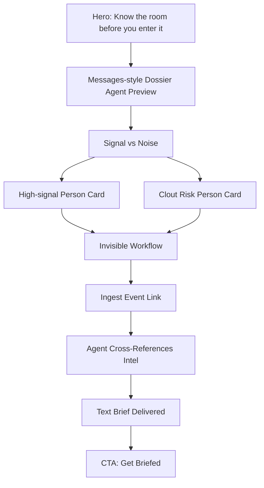

# Dossier Landing Page

## Product

**Dossier** is a pre-event intelligence agent that texts you who matters, what to say, and what to remember before you walk into a room.

## Core positioning

**Know the room before you enter it.**

Dossier turns a Luma, Partiful, or calendar link into a private intelligence brief. It scans attendee context, checks memory, ranks high-signal people, flags clout risks, writes openers, and drafts follow-ups.

## Landing page goal

Make the product feel like:

- Apple Messages meets CIA briefing
- Gen Z social intelligence, not enterprise CRM
- Fast, useful, provocative, and slightly funny
- A tool that texts you the brief, instead of making you open a dashboard

## Navigation

- Intelligence
- Workflow
- Risk Analysis
- CTA: **Get Briefed**

---

# Hero Section

## Status badge

**Secure Connection Established**

## Headline

**Know the room before you enter it.**

## Subheadline

Dossier is a pre-event intelligence agent that texts you who matters, what to say, and what to remember before you walk into a room. A CIA briefing for your social life.

## CTA buttons

Primary: **Start Scan**  
Secondary: **View Sample Brief**

## Hero visual: Messages-style agent preview

### Header

**Dossier Agent**  
Active Now

### User message

Can you pull context for the AI Founder Party tonight?

### Agent message 1

**Scanning attendees...**

You have **AI Founder Party** tonight at 8 PM.

I scanned 47 attendees.

### Agent message 2

I found **5 people worth meeting**, **2 clout risks**, and **1 person you forgot to follow up with**.

Buttons:

- Send me the brief
- Show risks

---

# Section 2: Signal vs Noise

## Headline

**Signal vs Noise**

## Copy

Stop wasting time on NPCs. Dossier automatically flags high-value connections and potential risks based on cross-referenced data.

## Person Card 1: Signal

### Maya Chen

**Healthcare AI Investor**

Badge: **94 Greenlight**

**Intel**  
Mutual friend: Alex. Interested in workflow AI.

**Recommended opener**  
“Are you seeing more healthcare AI founders start with workflow wedges or diagnostics?”

## Person Card 2: Noise

### Jake

**“Stealth Founder”**

Badge: **31 Clout Risk**

**Flags**  
No product link. 14 podcast clips. Over-indexes on buzzwords.

**Directive**  
Talk if bored. Do not pitch.

---

# Section 3: Invisible Workflow

## Headline

**Invisible Workflow**

## Copy

No manual data entry. Drop a link, and Dossier’s background agents compile the room before you arrive.

## Workflow Cards

### Phase 1: Ingest

Paste Luma, Partiful, or calendar links. Dossier extracts the attendee list instantly.

### Phase 2: Agent Run

Dossier cross-references intel across:

- LinkedIn snippets
- Past memory
- Public bios
- Event context
- Personal notes

### Phase 3: The Brief

One hour before the event, receive a high-signal text message detailing exactly who matters and what to say.

No apps to open. No dashboards to check.

CTA: **Get Briefed**

---

# Footer

**Dossier**

© 2024 Dossier AI. Actionable Intelligence for High-Stakes Interactions.

Footer links:

- Privacy Protocol
- Terms of Service
- Security Whitepaper

---

# Visual Direction

## Style

Minimal, clean, and premium. The page should feel like a security briefing mixed with a modern messaging app.

## Colors

- Background: white
- Primary text: near-black / gray-900
- Accent: green / emerald
- Risk accent: orange
- Cards: white with subtle gray border
- Dark CTA block: gray-900 / near-black

## Typography

Use **Inter**.

- Hero headline: bold, tight tracking, 56–64px desktop
- Body copy: 16–18px, relaxed line height
- Labels: uppercase, small, letter-spaced

## UI feel

- Rounded cards
- Thin borders
- Soft shadows
- Messages-style hero preview
- Green status indicators
- Risk badges for clout / low-signal people

---

# Landing Page Structure

---

# MVP Landing Page Copy

## Short pitch

Dossier texts you a private room brief before every event.

## Longer pitch

Before you walk into a room, Dossier scans the event, finds the high-signal people, flags the clout risks, remembers who you met before, and gives you exactly what to say.

## Funny hook

Find the main characters before you waste your night on NPCs.

## VC hook

The context layer for real-world networking.

## Gen Z hook

Never walk in blind.

## Demo hook

Dossier scanned 47 attendees and found the 5 people worth meeting.

---

# Engineering Notes

## Inputs

- Luma link
- Partiful link
- Calendar event
- Manual attendee list
- LinkedIn snippets
- Instagram/public bio snippets
- Personal notes
- Past event memory

## Agent outputs

- Room brief
- High-signal people
- Clout-risk people
- Best opener
- Follow-up draft
- Memory update

## Core tables

### users

- id
- name
- goals
- tone

### events

- id
- user_id
- name
- date
- url
- status

### attendees

- id
- event_id
- name
- role
- company
- bio
- links

### person_memory

- id
- user_id
- attendee_id
- last_interaction
- notes
- follow_up_status
- importance_score

### recommendations

- id
- event_id
- attendee_id
- greenlight_score
- clout_risk_score
- reason
- opener
- directive

### agent_runs

- id
- event_id
- trigger_type
- status
- summary
- created_at

---

# Demo Script

“Most people walk into events blind. Dossier is a pre-event intelligence agent that texts you a brief before you arrive.

Here’s an AI Founder Party tonight. The agent scanned 47 attendees, checked public context, remembered who I met before, ranked who matters, flagged clout risks, and wrote openers.

Instead of opening a dashboard, it texts me: ‘I found 5 people worth meeting, 2 clout risks, and 1 person you forgot to follow up with.’

This is not a chatbot. It ran in the background, used memory, made decisions, and created the next action before I asked.”

---

# Best one-liner

**Dossier is a pre-event intelligence agent that tells you who matters, what to say, and who to avoid before you walk into the room.**
